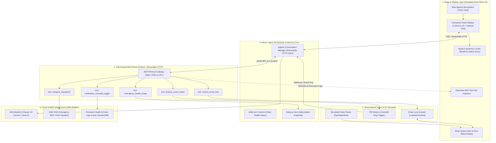
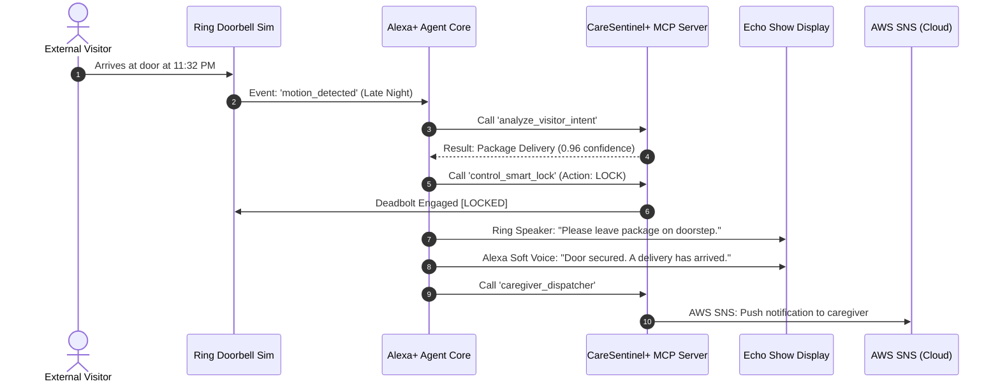
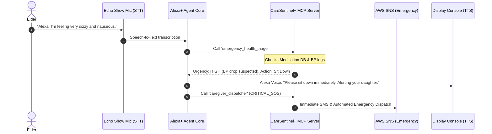

# 🛡️ CareSentinel+
> **Autonomous Voice & Vision Ambient Care & Home Safety for Solo Living & Elderly Care**

[](https://amazonappdev2026.devpost.com/)
[-blue.svg)](https://modelcontextprotocol.io/)
[](https://developer.amazon.com/docs/ring/)
[](https://aws.amazon.com/bedrock/)
[](LICENSE)

---

## 📌 Executive Summary

**CareSentinel+** is a proactive ambient care and security system that unites **Alexa+**, **Ring**, and **AWS Cloud** into a single intelligent ecosystem. 

Rather than acting as a passive voice assistant that waits for instructions, CareSentinel+ operates as an **autonomous, proactive guardian**:
- 🚪 **Front-Door Vigilance (Ring Integration):** Analyzes doorbell camera events, locks doors automatically during late-night deliveries, and interacts with visitors without exposing vulnerable elders.
- 🎙️ **Ambient Health Companion (Alexa+ & MCP):** Understands natural spoken distress (*"Alexa, I feel dizzy"*), triggers emergency triage protocols, verifies drug safety, and dispatches urgent alerts to family members via AWS SNS.
- ⚡ **Zero-Hallucination Safety:** Uses strict, deterministic **Model Context Protocol (MCP)** tools rather than ungrounded LLM guesses.

---

## 🏛️ System Architecture

CareSentinel+ follows an event-driven, edge-cloud hybrid architecture using **Streamable HTTP MCP** (Spec 2025-11-25+).



---

## 🔄 Core Workflows & Scenarios

### 1. Late Night Delivery (Proactive Perimeter Defense)


### 2. Ambient Medical Distress & SOS Triage


---

## 🛠️ Tech Stack & Key Choices

| Layer | Technology | Rationale | Cost |
| :--- | :--- | :--- | :--- |
| **Frontend Console** | Next.js 15, TypeScript, Tailwind CSS | Simulates Echo Show 15 smart display, fast, deployable to Vercel in 1 click | **$0 Free** |
| **Voice Engine** | Web Speech API (`SpeechRecognition` & `SpeechSynthesis`) | Browser-native speech recognition and speech output, zero external API keys needed | **$0 Free** |
| **Agent / MCP Server** | Python (FastMCP / FastAPI) | Implements official Model Context Protocol (Streamable HTTP spec 2025-11-25+) | **$0 Free** |
| **Smart Camera / IoT** | Ring Simulator Engine | Simulates Ring Doorbell events, PIR sensor, and deadbolt actuator | **$0 Free** |
| **Cloud Intelligence** | AWS Bedrock (`boto3`) + Local Fallback | High-fidelity reasoning with zero-cost local heuristic fallback | **$0 Free (Credits)** |
| **Notification Engine** | AWS SNS (Simple Notification Service) | Real-time SMS & webhook dispatch for emergency caregivers | **$0 Free** |

---

## 📋 MCP Tools Reference

CareSentinel+ exposes 5 strictly typed Model Context Protocol tools:

1. `analyze_visitor_intent`: Classifies motion events, distinguishes delivery vs familiar vs suspicious visitors.
2. `control_smart_lock`: Interacts with simulated deadbolt to lock/unlock and verify physical security.
3. `emergency_health_triage`: Evaluates reported symptoms against vitals history and guidelines without ungrounded hallucinations.
4. `caregiver_dispatcher`: Dispatches categorized alerts (INFO, WARNING, CRITICAL_SOS) via AWS SNS.
5. `medication_schedule_logger`: Logs medication compliance, prevents accidental duplicate doses, checks interactions.

---

## 🚀 Getting Started (Local Development)

### Prerequisites
- Node.js 18+ & npm
- Python 3.10+ & pip

### 1. Run MCP Server (Backend)
```bash
cd mcp-server
pip install -r requirements.txt
python server.py
# Server runs on http://localhost:8000 (Streamable HTTP / SSE)
```

### 2. Run Echo Show Simulator (Frontend)
```bash
cd frontend
npm install
npm run dev
# Open http://localhost:3000 in your browser
```

---

## 📜 Hackathon Compliance Guarantee
- [x] **Primary Track:** Alexa+ (Self-hosted Streamable HTTP MCP Server spec 2025-11-25+ with real code imports).
- [x] **Cross Integration:** Ring API / Simulator compliance.
- [x] **AWS Builder Mini Challenge:** AWS Bedrock and AWS SNS integration documented.
- [x] **Open Source Challenge:** MIT License included.
- [x] **Zero Hardware Dependency:** Runs end-to-end on standard browser & PC.
- [x] **Strict Git Governance:** Zero remote Git pushes without explicit maintainer confirmation.
