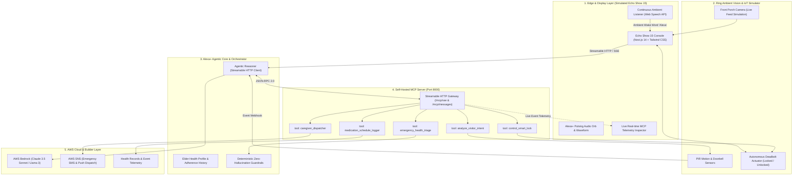

# 🛡️ CareSentinel+
> **Autonomous Ambient Care & Home Safety Hub for Solo Living & Elderly Care**  
> *Powered by Alexa+ (Streamable HTTP MCP), Ring Smart Vision & IoT, and AWS Cloud*

[](https://amazonappdev2026.devpost.com/)
[](https://modelcontextprotocol.io/)
[](https://ring.com/)
[](https://aws.amazon.com/bedrock/)
[-success.svg?style=for-the-badge)](mcp-server/test_suite.py)
[](LICENSE)

---

## ⚡ 30-Second Executive Summary for Hackathon Judges

### ❓ The Problem
Over **58 million elderly individuals** live alone globally. Traditional smart home devices are entirely **passive**:
- If an elder falls or experiences dizziness, they cannot grab their phone or browse an app.
- Traditional voice assistants only answer static queries (*"What's the weather?"*); they cannot coordinate locks, cameras, and emergency triage.
- Inadvertent medication double-dosing is one of the leading causes of preventable geriatric hospitalization.

### 💡 The Solution: CareSentinel+
**CareSentinel+** transforms smart home hardware from passive gadgets into an **autonomous ambient guardian**. By connecting **Alexa+** with **Ring Vision** and **Smart Locks** through the **Model Context Protocol (MCP)**, CareSentinel+ reasons, decides, and acts autonomously in real-time.

---

## 🚨 The 4 Critical Crises CareSentinel+ Solves (Why It Matters)

| Crisis / Problem | The Harsh Reality Today (Without CareSentinel+) | How CareSentinel+ Solves It Autonomously |
| :--- | :--- | :--- |
| **1. The "Long Lie" & Locked Door Dilemma** | Falls are the #1 cause of fatal injury in seniors (WHO). An elder falls on the bathroom or bedroom floor, cannot reach a phone, and lies helpless for 6–12 hours. Even if neighbors notice, **the front door is locked from the inside**, causing emergency responders to waste 30+ critical minutes forcing entry. | **Autonomous Voice Triage & Emergency Unlock:** The elder simply speaks from the floor: *"Alexa, I fell and hurt my hip."* Alexa immediately triggers clinical triage, **automatically unlocks the front deadbolt** for first responders, and dispatches an emergency SOS with exact coordinates to family via AWS SNS. |
| **2. Fatal Medication Double-Dosing** | Over 40% of seniors over 65 suffer mild cognitive impairment. Forgetting that they took their blood pressure or diabetes dose 45 minutes earlier, they take another, causing acute hypotension or hypoglycemic shock. | **Deterministic Clinical Gatekeeper:** When a senior says *"I'm taking my Metformin"*, CareSentinel+ checks the timestamped MCP history. If already consumed, Alexa actively intervenes: *"Hold on! You already took Metformin today at 8:15 AM. Please do not take an extra dose."* |
| **3. Senior Scamming & Nighttime Intruder Exposure** | Criminals and aggressive solicitors frequently target solo seniors after dark. Seniors often open the front door out of confusion or courtesy, exposing themselves to home invasions. | **Proactive Perimeter Defense & Two-Way Proxy:** When Ring detects movement at night (e.g., 11:32 PM), CareSentinel+ analyzes visitor intent, keeps the deadbolt locked, and speaks directly to the driver via the outdoor Ring speaker (*"Please leave package on doorstep"*), keeping the senior safe inside. |
| **4. Caregiver Distance Anxiety & Family Guilt** | Adult children living in different cities or working long hours endure chronic anxiety, constantly worrying whether their aging parents took their pills, answered the door, or are lying injured. | **24/7 Telemetry & Instant Peace of Mind:** Caregivers receive instant, structured updates via AWS SNS (SMS and push notifications) only when genuine attention is needed, eliminating nagging calls while maintaining safety. |


---

## 🏛️ System Architecture

CareSentinel+ follows a 5-layer event-driven architecture bridging Edge devices, self-hosted MCP agents, and AWS Cloud infrastructure:



---

## 🖥️ Why We Built the Echo Show 15 Frontend UI (The Rationale)

In a live production deployment, CareSentinel+ runs directly on a wall-mounted **Amazon Echo Show 15** smart display connected to physical Ring doorbells and smart deadbolts. For this hackathon and open-source release, we engineered a dedicated Next.js web console for four key reasons:

1. **Zero-Hardware Accessibility for Judges & Reviewers:**
   Requiring physical hardware would demand **$500+** in equipment ($280 Echo Show 15 + $100 Ring Doorbell + $150 Smart Lock). Our browser-based console allows hackathon evaluators and developers worldwide to experience the complete voice, vision, and actuator loop on any computer with zero hardware prerequisites.
2. **Multi-Modal Geriatric Accessibility (Voice + Visual Cards):**
   Elderly individuals frequently experience mild hearing impairment or cognitive fatigue. Pure voice assistants can be overwhelming when reciting lengthy spoken updates. The Echo Show 15 UI provides high-contrast, glanceable visual cards (real-time door status, vitals telemetry, and interactive medication checkmarks) alongside natural spoken confirmations.
3. **Effortless Interactive Scenario Evaluation:**
   Reviewers can trigger simulated real-world edge cases (e.g., an 11:32 PM late-night delivery or an acute ground fall) with a single click, observing how Ring vision, smart locks, and Alexa+ coordinate synchronously.
4. **Under-the-Hood Transparency (Real-Time MCP Inspector):**
   The console features a collapsible **MCP Telemetry Inspector** that reveals live JSON-RPC 2.0 tool calls, parameter payloads, and responses as they stream through the Streamable HTTP gateway in real time.

---

## 🛠️ The 5 Model Context Protocol (MCP) Tools

All tools are implemented in [`mcp-server/tools/`](mcp-server/tools/) following strict Pydantic schemas:

| # | Tool Name | Role & Functionality | Inputs | Key Outputs |
| :-: | :--- | :--- | :--- | :--- |
| **1** | `analyze_visitor_intent` | Analyzes Ring camera feed & timestamps to classify delivery, stranger, or loiterer. | `event_type`, `timestamp`, `detected_objects` | `intent`, `confidence`, `risk_level`, `recommended_action` |
| **2** | `control_smart_lock` | Engages/disengages deadbolt for resident security or emergency first responders. | `door_id`, `action` (`LOCK`/`UNLOCK`) | `status`, `success`, `timestamp` |
| **3** | `emergency_health_triage` | Clinically triages reported symptoms against AHA/geriatric rules to prevent hallucinations. | `symptoms`, `reported_severity_scale` | `urgency_level`, `immediate_first_aid`, `should_alert_ems` |
| **4** | `caregiver_dispatcher` | Dispatches priority SMS, app push, and automated calls to family via AWS SNS. | `alert_level`, `message`, `patient_status` | `dispatch_id`, `channels`, `status` |
| **5** | `medication_schedule_logger` | Logs doses, verifies schedules, and intercepts dangerous double-doses. | `medication_name`, `action`, `reminder_time` | `status`, `interaction_warning`, `next_due_time` |

---

## 🎬 4 Interactive Scenarios (Testable in 60 Seconds)

Judges can test all 4 scenarios directly using the top simulation buttons or natural voice:

```
+-----------------------------------------------------------------------------------+
|  [🌙 Late Night Delivery]  [⚠️ Unknown Loiterer]  [🚨 Ground Fall SOS]  [💊 Meds]  |
+-----------------------------------------------------------------------------------+
```

### 1. 🌙 Late-Night Delivery (11:32 PM)
- **Trigger:** Click *"Late Night Delivery"* button.
- **Autonomous Flow:**
  1. Ring detects movement at 11:32 PM.
  2. `analyze_visitor_intent` identifies package delivery (confidence: 96%).
  3. `control_smart_lock` automatically deadbolts the front door.
  4. Outdoor Ring speaker instructs the courier: *"Please leave the package at the doorstep. The resident is resting."*
  5. Alexa speaks inside to reassure the elder: *"Front door secured. A late-night delivery was detected."*

### 2. 🚨 Ground Fall & Acute Medical Distress
- **Trigger:** Say *"Alexa, I fell down and hurt my hip"* or click *"Ground Fall SOS"*.
- **Autonomous Flow:**
  1. `emergency_health_triage` flags urgency as `CRITICAL_SOS`.
  2. Alexa calms the senior: *"Help is on the way! I have unlocked the door for responders and notified your daughter Priya."*
  3. `control_smart_lock` **unlocks** the deadbolt so paramedics don't have to break down the door.
  4. `caregiver_dispatcher` fires high-priority SMS alerts via AWS SNS.

### 3. 💊 Geriatric Double-Dose Prevention
- **Trigger:** Say *"Alexa, I just took my Metformin 500mg"*.
- **Autonomous Flow:**
  1. First time: Marks checklist green (✔) with audio confirmation.
  2. Say it again: `medication_schedule_logger` flags duplicate intake.
  3. Alexa immediately intervenes: *"Hold on! You have already taken Metformin today. Please do not take an extra dose."*

### 4. ⏰ Dynamic Voice Medication Reminders
- **Trigger:** Say *"Alexa, remind me to take my vitamins everyday at 6am"*.
- **Autonomous Flow:**
  1. Regex & NLP time parser extracts `"Vitamins"` and `"06:00 AM"`.
  2. Checklist dynamically inserts a new regimen item: **Vitamins (Daily Regimen) - 06:00 AM**.
  3. Alexa confirms adherence tracking.

---

## 🚀 Quickstart Guide (Run Locally in Under 2 Minutes)

### Prerequisites
- **Node.js** (v18 or higher)
- **Python** (v3.10 or higher)

### Method A: One-Click Launch (Windows)
Double-click [`start.bat`](start.bat) in the project root:
```cmd
start.bat
```
*This automatically starts both the Python MCP server (port 8000) and Next.js frontend (port 3005) in separate windows.*

---

### Method B: Manual Step-by-Step

#### Step 1: Start the MCP Server (Backend)
```bash
cd mcp-server
pip install -r requirements.txt
python -m uvicorn server:app --host 127.0.0.1 --port 8000
```
*Backend is live at `http://127.0.0.1:8000` with Streamable HTTP MCP endpoints.*

#### Step 2: Start the Echo Show 15 Simulator (Frontend)
```bash
cd frontend
npm install
npm run dev
```
*Open `http://localhost:3005` in Google Chrome or any modern browser.*

---

## 🧪 Automated Test Suite Verification

CareSentinel+ includes a standalone verification suite testing all 5 MCP tools and end-to-end orchestration:

```bash
cd mcp-server
python test_suite.py
```

### Test Suite Output:
```text
==================================================
 Running CareSentinel+ MCP Server Automated Tests
==================================================

--- Testing 1: analyze_visitor_intent ---
 [PASS] Package delivery detected with confidence 0.96
 [PASS] High-risk loiterer detected at 02:15

--- Testing 2: control_smart_lock ---
 [PASS] Lock engaged: Deadbolt successfully engaged
 [PASS] Status verified: Front Door is currently LOCKED

--- Testing 3: emergency_health_triage ---
 [PASS] Elevated triage for dizziness
 [PASS] Critical SOS triage for severe fall distress

--- Testing 4: medication_schedule_logger ---
 [PASS] Query next medication schedule
 [PASS] Double-dose prevention safety trigger

--- Testing 5: caregiver_dispatcher ---
 [PASS] Caregiver dispatch generated via AWS SNS

--- Testing 6: AlexaAgentOrchestrator End-to-End ---
 [PASS] Voice lock execution
 [PASS] Voice medical triage execution
 [PASS] Ring scenario 'late_night_delivery' executed 3 tools

==================================================
 ALL 6 MCP AND ORCHESTRATION TESTS PASSED! (100%)
==================================================
```

---

## 📂 Project Directory Structure

```text
CareSentinel+/
├── .gitignore
├── LICENSE                          # MIT Open Source License
├── README.md                        # Master Project Documentation & Quickstart
├── SYSTEM_DESIGN.md                 # In-depth architectural specification & flows
├── FRICTION_LOG.md                  # Developer ecosystem & API feedback
├── start.bat                        # One-click Windows starter script
│
├── mcp-server/                      # Self-Hosted Python MCP Server
│   ├── server.py                    # Streamable HTTP MCP (Spec 2025-11-25+)
│   ├── config.py                    # Environment & AWS configuration settings
│   ├── models.py                    # Pydantic schemas for MCP tools & events
│   ├── requirements.txt             # Python dependencies
│   ├── test_suite.py                # 6/6 automated test suite
│   ├── agent/
│   │   └── orchestrator.py          # Alexa+ reasoning engine & Bedrock bridge
│   └── tools/
│       ├── visitor_tools.py         # analyze_visitor_intent
│       ├── security_tools.py        # control_smart_lock
│       ├── health_tools.py          # emergency_health_triage & medication logger
│       └── dispatch_tools.py        # caregiver_dispatcher (AWS SNS)
│
└── frontend/                        # Echo Show 15 Smart Display Simulator
    ├── package.json                 # Next.js 14, Tailwind, Lucide Icons
    ├── tailwind.config.ts           # Luxury dark aesthetic styling
    └── src/
        ├── app/
        │   ├── layout.tsx           # Shell layout
        │   ├── page.tsx             # Master reactive dashboard & state sync
        │   └── globals.css          # Dark-mode styling rules
        └── components/
            ├── HeaderBar.tsx        # System status, lock toggle, time
            ├── RingCameraView.tsx   # Simulated Ring video feed & scenarios
            ├── AlexaVoiceSphere.tsx # Ambient speech listener & audio waveform
            ├── VitalsWidget.tsx     # Telemetry & interactive medication checklist
            └── MCPInspector.tsx     # Real-time tool-call telemetry inspector
```

---

## 🛡️ Hackathon Submission Deliverables & Links

- **Devpost Project Submission:** [Amazon Developer Hackathon: Build, Ship, Shape 2026](https://amazonappdev2026.devpost.com/)
- **GitHub Repository:** [github.com/RITIKSINGH-DEOS/CareSentinel-Plus](https://github.com/RITIKSINGH-DEOS/CareSentinel-Plus.git)
- **System Architecture & Technical Specification:** [`SYSTEM_DESIGN.md`](SYSTEM_DESIGN.md)
- **Developer Ecosystem Feedback:** [`FRICTION_LOG.md`](FRICTION_LOG.md)
- **Open Source License:** [`LICENSE`](LICENSE) (Official MIT Open Source License)

---

## 👨‍💻 Team & Acknowledgments

Built with ❤️ for the **Amazon Developer Hackathon: Build, Ship, Shape 2026**.  
Dedicated to improving independence, safety, and dignity for elderly solo-living individuals worldwide.
