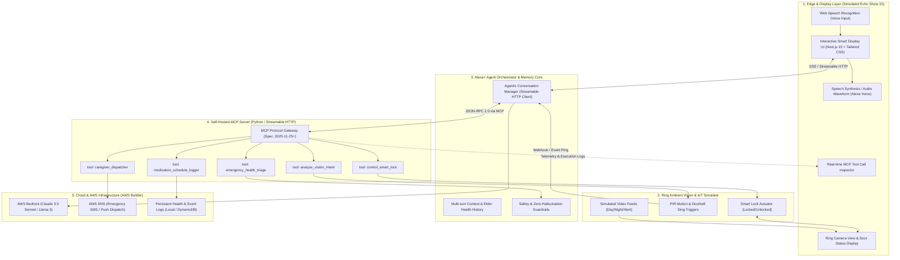
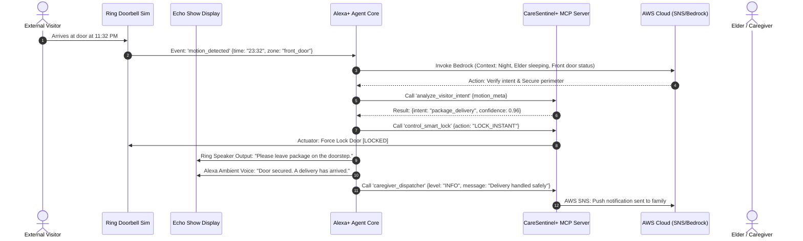
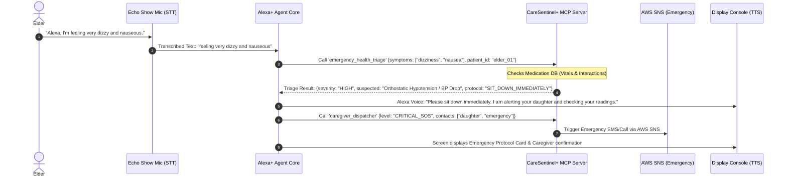

# CareSentinel+ — System Design & Architecture Specification

> **Event:** Build, Ship, Shape: Amazon Developer Hackathon 2026  
> **Tracks:** Alexa+ (Self-hosted MCP Server, Streamable HTTP 2025-11-25+), Ring API Simulator, AWS Builder  
> **Target Devices:** Amazon Echo Show 15 (Simulated), Ring Video Doorbell & Smart Lock (Simulated)

---

## 1. High-Level System Architecture

CareSentinel+ bridges the front door (Ring), the living room (Alexa+ Smart Display), and the cloud (AWS) through an event-driven, agentic architecture powered by the open **Model Context Protocol (MCP)**.

---

## 2. Sequence Diagrams (Core Workflows)

### Scenario A: Proactive Front-Door Guardian (Late Night Delivery Event)
Jab raat ko darwaze par motion detect hota hai, system reactive nahi balki **proactively** act karta hai:

---

### Scenario B: Ambient Health Distress & Emergency Triage Flow
Jab elder natural voice me distress express karte hain:

---

## 3. Component Details & Technical Specifications

| Component | Technology | Responsibility |
| :--- | :--- | :--- |
| **Echo Show 15 Console** | Next.js 15, TypeScript, Tailwind CSS | High-contrast elder-friendly UI, real-time tool logs, Ring feed player, visual speech waveform. |
| **Voice Processing** | Web Speech API (`SpeechRecognition` & `SpeechSynthesis`) | Browser-native, zero-latency voice recognition and natural speech response without costly third-party speech APIs. |
| **Alexa+ Agent Engine** | Python / Next.js API Routes | Context memory, reasoning loop, Streamable HTTP SSE client for real-time conversation. |
| **MCP Server Gateway** | Python FastMCP (Spec: 2025-11-25+) | Exposes standard MCP tools over Streamable HTTP (SSE + POST) compliant with Amazon's latest Alexa+ guidelines. |
| **Ring IoT Simulator** | TypeScript Event Dispatcher | Simulates Ring REST APIs, webhook payloads, PIR sensors, and smart deadbolt actuator states. |
| **Cloud Intelligence** | AWS Bedrock (`anthropic.claude-3-5-sonnet` / `meta.llama3`) | Multi-modal reasoning, complex symptom analysis, and natural tone generation. |
| **Emergency Dispatch** | AWS SNS / Mock Telephony | Dispatches structured SMS, emails, and Webhook alerts to family members and doctors. |

---

## 4. MCP Tools Schema (Model Context Protocol Specification)

CareSentinel+ exposes 5 deterministic, strictly typed tools via Streamable HTTP:

### 1. `analyze_visitor_intent`
- **Input:** `event_type: string`, `timestamp: string`, `metadata: object`
- **Output:** `intent: "delivery" | "family" | "unknown" | "suspicious"`, `risk_level: "LOW" | "MEDIUM" | "HIGH"`

### 2. `control_smart_lock`
- **Input:** `door_id: string`, `action: "LOCK" | "UNLOCK" | "VERIFY_STATE"`
- **Output:** `status: "LOCKED" | "UNLOCKED"`, `timestamp: string`, `success: boolean`

### 3. `emergency_health_triage`
- **Input:** `symptoms: string[]`, `patient_id: string`, `vitals_snapshot?: object`
- **Output:** `urgency_level: "ROUTINE" | "ELEVATED" | "CRITICAL_SOS"`, `first_aid_action: string`, `escalate_call: boolean`

### 4. `caregiver_dispatcher`
- **Input:** `alert_level: "INFO" | "WARNING" | "CRITICAL_SOS"`, `message: string`, `patient_status: string`
- **Output:** `dispatch_id: string`, `recipients_notified: string[]`, `delivered_via: string[]`

### 5. `medication_schedule_logger`
- **Input:** `patient_id: string`, `medication_name: string`, `action: "TAKEN" | "SKIPPED" | "QUERY_NEXT"`
- **Output:** `next_dose_due: string`, `interaction_warning: string | null`, `status: "CONFIRMED"`

---

## 5. Security, Safety & Zero-Hallucination Architecture

1. **Deterministic Safety Guardrails:**
   - LLMs can hallucinate medical dosages or open doors accidentally. In CareSentinel+, the LLM **never** directly unlocks doors or prescribes meds. It is only allowed to call **strongly typed MCP Tools** with hardcoded boundary checks.
2. **Local Edge Fallback:**
   - If cloud connectivity drops or AWS Bedrock fails, the MCP Server features local heuristic fallback rules (e.g., if motion detected after 11 PM and door is unlocked -> immediately auto-lock).
3. **Privacy by Design:**
   - Raw video from the Ring camera simulator is never uploaded to the LLM. Only structured, anonymized semantic metadata (e.g., `{object: "person", time: "23:32"}`) is shared with the agent.
